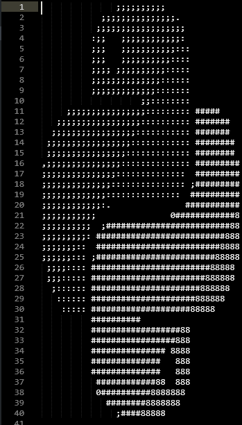
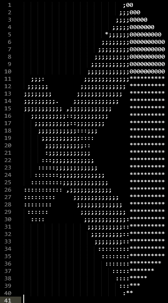
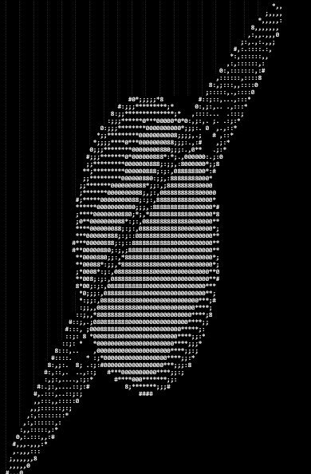

# Ascii_art 

Use Webcam on command line or Turn image into ascii charaters or use camera in command line shell with python .

 - Used Libraries  

    -  OpenCV :

        ` >> pip install opencv-python`

    -  Numpy  :

        ` >> pip install numpy`

## examples :

|  image | ascii image |
| :---: | :---: |
|   |   |
|   |   |
|   |   |
